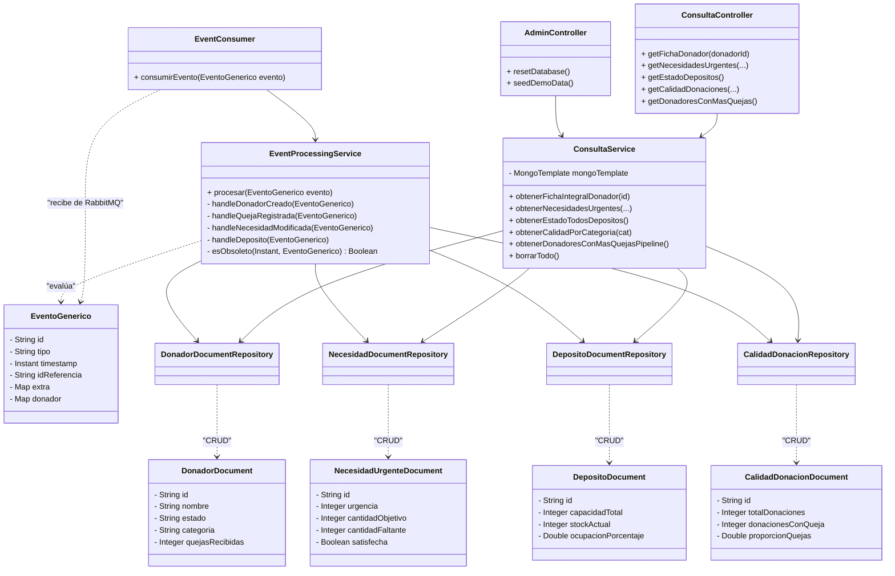

```mermaid
classDiagram
    class ConsultaController {
        + getFichaDonador(donadorId)
        + getNecesidadesUrgentes(...)
        + getEstadoDepositos()
        + getCalidadDonaciones(...)
        + getDonadoresConMasQuejas()
    }
    
    class AdminController {
        + resetDatabase()
        + seedDemoData()
    }

    class ConsultaService {
        - MongoTemplate mongoTemplate
        + obtenerFichaIntegralDonador(id)
        + obtenerNecesidadesUrgentes(...)
        + obtenerEstadoTodosDepositos()
        + obtenerCalidadPorCategoria(cat)
        + obtenerDonadoresConMasQuejasPipeline()
        + borrarTodo()
    }

    class EventProcessingService {
        + procesar(EventoGenerico evento)
        - handleDonadorCreado(EventoGenerico)
        - handleQuejaRegistrada(EventoGenerico)
        - handleNecesidadModificada(EventoGenerico)
        - handleDeposito(EventoGenerico)
        - esObsoleto(Instant, EventoGenerico) Boolean
    }

    class EventConsumer {
        + consumirEvento(EventoGenerico evento)
    }

    class EventoGenerico {
        - String id
        - String tipo
        - Instant timestamp
        - String idReferencia
        - Map extra
        - Map donador
    }

    class DonadorDocumentRepository
    class NecesidadDocumentRepository
    class DepositoDocumentRepository
    class CalidadDonacionRepository

    class DonadorDocument {
        - String id
        - String nombre
        - String estado
        - String categoria
        - Integer quejasRecibidas
    }
    
    class NecesidadUrgenteDocument {
        - String id
        - Integer urgencia
        - Integer cantidadObjetivo
        - Integer cantidadFaltante
        - Boolean satisfecha
    }

    class DepositoDocument {
        - String id
        - Integer capacidadTotal
        - Integer stockActual
        - Double ocupacionPorcentaje
    }
    
    class CalidadDonacionDocument {
        - String id
        - Integer totalDonaciones
        - Integer donacionesConQueja
        - Double proporcionQuejas
    }

    ConsultaController --> ConsultaService
    AdminController --> ConsultaService
    
    EventConsumer --> EventProcessingService
    EventConsumer ..> EventoGenerico : "recibe de RabbitMQ"
    EventProcessingService ..> EventoGenerico : "evalúa"
    
    ConsultaService --> DonadorDocumentRepository
    ConsultaService --> NecesidadDocumentRepository
    ConsultaService --> DepositoDocumentRepository
    ConsultaService --> CalidadDonacionRepository
    
    EventProcessingService --> DonadorDocumentRepository
    EventProcessingService --> NecesidadDocumentRepository
    EventProcessingService --> DepositoDocumentRepository
    EventProcessingService --> CalidadDonacionRepository
    
    DonadorDocumentRepository ..> DonadorDocument : "CRUD"
    NecesidadDocumentRepository ..> NecesidadUrgenteDocument : "CRUD"
    DepositoDocumentRepository ..> DepositoDocument : "CRUD"
    CalidadDonacionRepository ..> CalidadDonacionDocument : "CRUD"
```