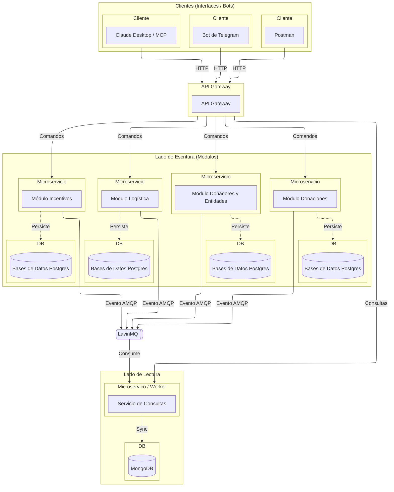

```mermaid
---
config:
  layout: elk
---
flowchart TB
subgraph Clientes["Clientes (Interfaces / Bots)"]
subgraph P["Cliente"]
R["Postman"]
end
subgraph TB["Cliente"]
T["Bot de Telegram"]
end
subgraph MCP["Cliente"]
M["Claude Desktop / MCP"]
end
end

subgraph AG["API Gateway"]
API["API Gateway"]
end

subgraph Escritura["Lado de Escritura (Módulos)"]
subgraph M1["Microservicio"]
A["Módulo Donaciones"]
end
subgraph M2["Microservicio"]
B["Módulo Donadores y Entidades"]
end
subgraph M3["Microservicio"]
C["Módulo Logística"]
end
subgraph M4["Microservicio"]
D["Módulo Incentivos"]
end
subgraph DB_E1["DB"]
E1[("Bases de Datos Postgres")]
end
subgraph DB_E2["DB"]
E2[("Bases de Datos Postgres")]
end
subgraph DB_E3["DB"]
E3[("Bases de Datos Postgres")]
end
subgraph DB_E4["DB"]
E4[("Bases de Datos Postgres")]
end
end

      RMQ["LavinMQ"]
      RMQ@{ shape: das}

subgraph Lectura["Lado de Lectura"]
subgraph SC["Microservico / Worker"]
Z["Servicio de Consultas"]
end
subgraph Mongo["DB"]
X[("MongoDB")]
end
end

    P -- HTTP --> AG
    TB -- HTTP --> AG
    MCP -- HTTP --> AG
    AG -- Comandos --> M1 & M2 & M3 & M4
    M1 -. Persiste .-> DB_E1
    M2 -. Persiste .-> DB_E2
    M3 -. Persiste .-> DB_E3
    M4 -. Persiste .-> DB_E4
    AG -- Consultas --> SC
    M1 -- Evento AMQP --> RMQ
    M2 -- Evento AMQP --> RMQ
    M3 -- Evento AMQP --> RMQ
    M4 -- Evento AMQP --> RMQ
    RMQ -- Consume --> SC
    SC -- Sync --> Mongo
```